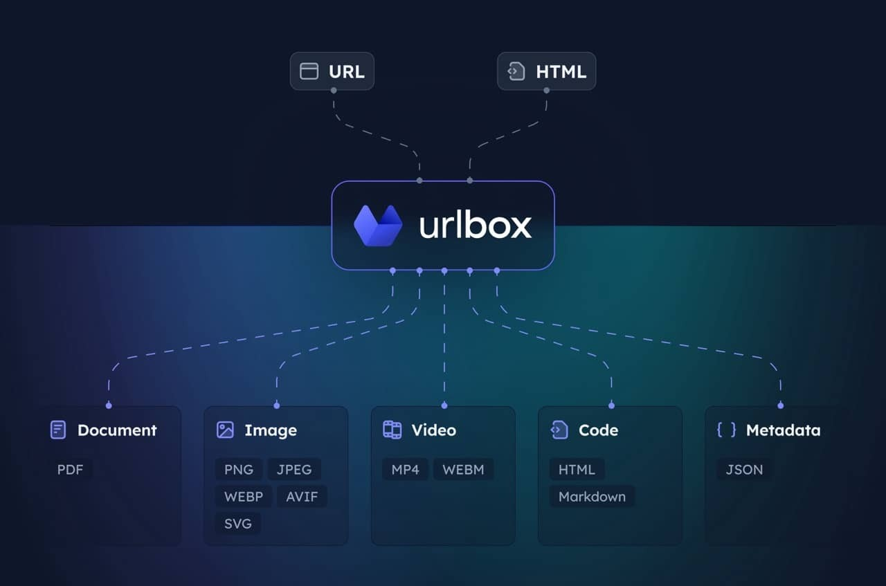

# Urlbox MCP Server

[](https://www.urlbox.com)

MCP server for the [Urlbox](https://urlbox.com) Screenshot API. Enables your client to take screenshots, generate PDFs, extract HTML/markdown, and more from websites.

Visit [Urlbox](https://urlbox.com) for more information, and have a read of our [docs](https://urlbox.com) or chat with your LLM post install to get a good understanding of its options and capabilities.

[](https://evanth.io/mcp/urlbox-screenshot-mcp)

## Setup

1. **Install dependencies and build:**
 
   ```bash
   npm install
   npm run build
   ```

2. **Get Urlbox API credentials:**
   - Sign up at [urlbox.com](https://urlbox.com)
   - Get your API Secret from the [ dashboard ](https://urlbox.com/dashboard)

3. **Set environment variables:**

> claude_desktop_config.json

```JSON 
{
  "mcpServers": {
    "screenshot": {
      "command": "npx",
      "args": ["-y", "@urlbox/screenshot-mcp"],
      "env": {
        "SECRET_KEY": "your_api_key_here"
      }
    }
  }
}
```

## Usage

The server provides a `render` tool that can:
- Take screenshots in multiple formats (PNG, PDF, MP4 and more)
- Convert pages to HTML, markdown
- Extract metadata and cookies
- Save files locally to your downloads with `store_renders: true`

Claude will automatically use this when you ask it to screenshot websites or convert web content.


## Useful prompts

**Take a clean screenshot without ads or cookie banners:**
```
Take a screenshot of https://example.com but block ads and hide cookie banners
```

**Screenshot and save side renders like HTML/markdown:**
```
Take a screenshot of https://example.com and also save it as HTML and markdown. Download the result to my computer.
```

**Generate a PDF of the full page:**
```
Convert https://urlbox.com to a PDF and save it to my computer. Make sure to generate a PDF that has an outline and is tagged.
```
